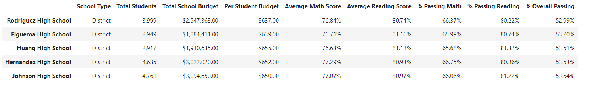

# School_District_Analysis
## Maria and her supervisor from the school board would like an anlysis of the school data. They have been informed that there is evidence of academic dishonesty in the math and reading scores of Thomas High School's ninth graders.

 
       
1. We will replace these altered 9th grade scores in math and reading for Thomas High School with "NaNs" per their request.
2. We will perform out school district analysis.
3. Then we will explain how these altered grade changes have affected the overall analysis. 

 

# Complete District Summary:

 

- The distrcict summary was not dramatically affected by the replacement of these altered testing scores. 

 
 

# Analysis based on school size:

 

- The data above suggests a similar overall passing percentage for small to medium sized schools. However, large schools with between 2000-5000 students have a significant decrease in percent of students who passed overall.
 
 

# Analysis of Spending Ranges(Per Student):

 

- The highest percentage of overall students passing is associated with the schools who have the least amount of spending available per student. This suggests that there is no direct correlation between a school's spending budget per student and the overall passing percentage.

 
 

# Analysis of school type:

 

- The data we have analyzed suggests that Charter schools perform better than District schools in both math and reading resulting in a higher overall passing percentage.

 
 

# District highest overall % passing schools:
 

 
 

# District lowest overall % passing schools:

 

 
 

# Summary:

 

### Unfortunately, it is difficult to determine how much of the 9th graders of Thomas High School Scores were a result of academic dishonesty. We were tasked to replace their score for math and reading with NaNs when conducting our analysis. This has resulted in some changes to the results. In our analysis of a schools overall passing percentage in correaltion to its size we seen a 7.2% decrease in overall passing percentage. Following, there was a drop of 9% in overall passing in the $631-$645 spending per student range. Lastly, medium schools with between 1000-1999 students overall passing percent fell 7.2%. We can gather from this data that replacing the 9th grade scores with NaNs has negatively skewed their overall analysis as a school and the overall disctrict analysis in the respective categories based on school size, per student budget, and type of school.

 
 

# Resources:

Resources: All data used in this analysis can be found inside of the Resources folder.

Software: Python 3.7, Anaconda, Jupyter Lab
